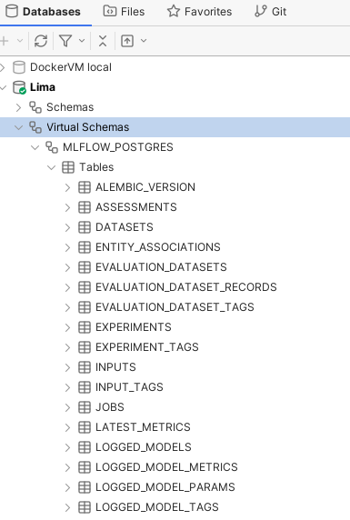

Backend Store Via Virtual Schema
================================

.. _virtual_schema: https://docs.exasol.com/db/latest/database_concepts/virtual_schemas.htm
.. _vs_dialects: https://github.com/exasol/virtual-schemas/blob/main/doc/user_guide/dialects.md
.. _postgres_virtual_schema:
   https://github.com/exasol/postgresql-virtual-schema/blob/main/doc/user_guide/postgresql_user_guide.md
.. _mysql_virtual_schema:
   https://github.com/exasol/mysql-virtual-schema/blob/main/doc/user_guide/mysql_user_guide.md

`Exasol Virtual Schemas <virtual_schema_>`_ can be used to map external data
sources to virtual tables that look like any regular Exasol tables and can be
queried as such.

Under some preconditions you can use a Virtual Schema for accessing
the MLflow Backend Store:

* You must be able to connect to the database backend used by the MLflow server.
* You must have appropriate credentials for accessing the database.
* MLflow must use a database backend for which a Virtual Schema implementation
  is available, e.g. PostgreSQL or MySQL, but not sqlite. See the list of
  supported `Virtual Schema dialects <vs_dialects_>`_.

.. warning::

    Please note that the approach described here bypasses MLflow access
    control and permissions.

    This approach should therefore be used with caution.

Instructions
------------

Install the virtual schema, see the resp. User Guide for

* `Postgres Virtual Schema <postgres_virtual_schema_>`_.
* `MySQL Virtual Schema <mysql_virtual_schema_>`_.

After that you can inspect the virtual schema in your SQL Editor,
e.g. DbVisualizer:

