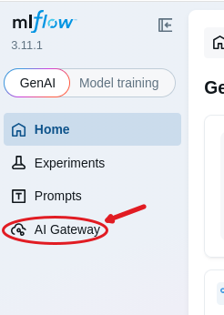
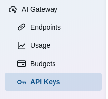
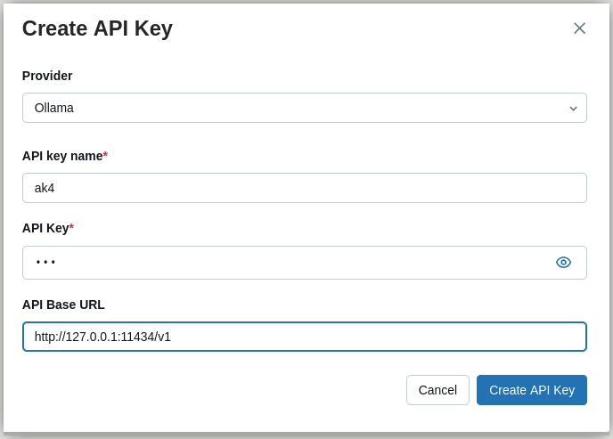
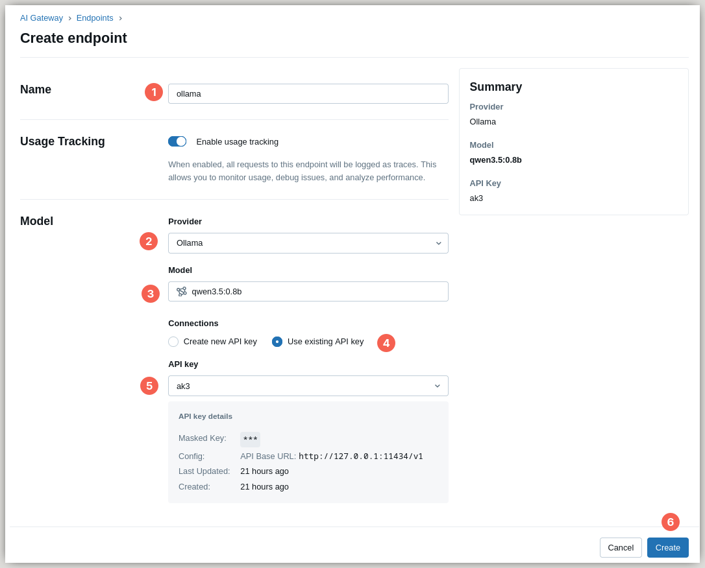
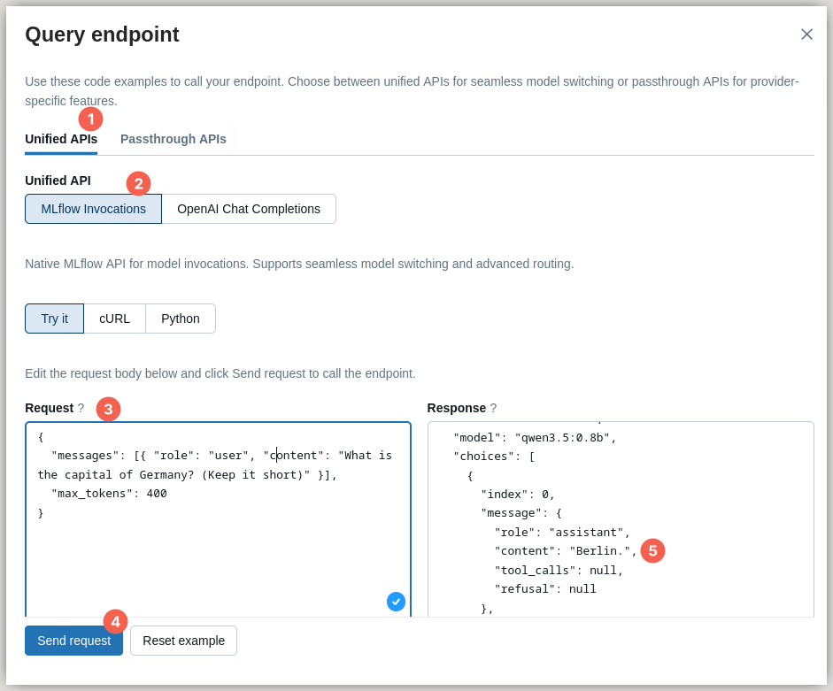
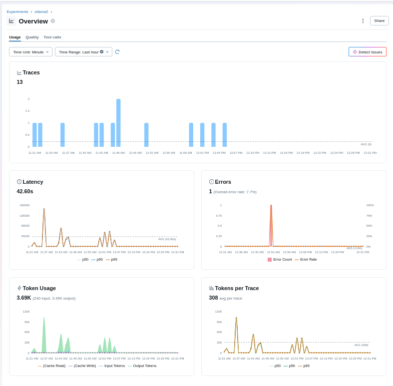
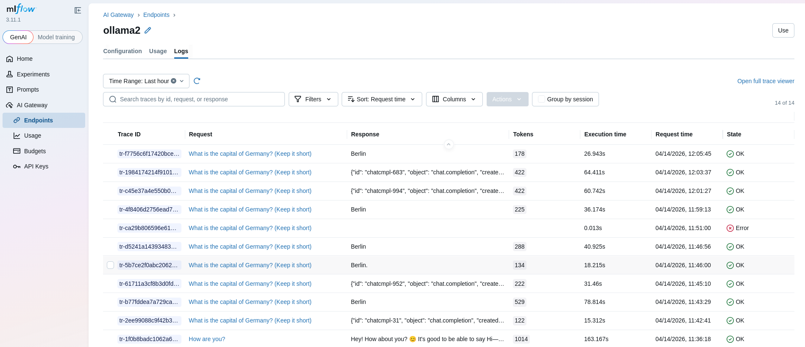

Accessing the MLflow AI Gateways from an Exasol UDF
===================================================

The following figure shows the basic system setup for accessing an MLflow AI
Gateway from within a UDF:

.. image:: img/ai-gateway/system-setup.svg
    :scale: 130 %

This section uses Ollama as a free-of-cost example for an AI Gateway.

Starting Ollama Server
----------------------

.. code-block:: shell

    ollama serve 2>ollama.log &

The log file will include the port the server is listening to

.. code-block:: shell

    OLLAMA_HOST:http://127.0.0.1:11434

Adding a Model to Ollama
------------------------

For adding a model you can use ollama command ``pull`` or ``run``.  We
selected model ``qwen3.5:0.8b``, which is about 1 GB in size:

.. code-block:: shell

    > ollama pull qwen3.5:0.8b
    > ollama list
    NAME            ID              SIZE      MODIFIED
    qwen3.5:0.8b    f3817196d142    1.0 GB    6 hours ago

Accessing Ollama From MLflow
----------------------------

+--------+---------------------------------------------------------+
+--------+---------------------------------------------------------+
| |pic1| | 1. Open the browser and navigate to your MLflow server, |
|        |    e.g. http://localhost:5000                           |
|        | 2. In the left side menu select "AI Gateway"            |
+--------+---------------------------------------------------------+

Creating an API Key
-------------------

Ollama actually does not need an API Key, but MLflow still requires you create
one as MLflow also manages other data together with the API Key.

1. In the left side menu select "API Key"
2. In the upper right corner click button "+ Create API key"
3. Select provider "Ollama"
4. Enter a name, e.g. ``ak1``
5. Enter a random API Key, e.g. ``xxx``
6. Enter base URL of the AI service ``http://127.0.0.1:11434/v1``

.. note::

    Suffix ``/v1`` needs to be appended to the value of `OLLAMA_HOST`, see
    Ollama docs on `openai-compatibility
    <https://ollama.com/blog/openai-compatibility>`_.

|pic3| |pic4|

Creating an Endpoint
--------------------

1. In the upper right corner click button "+ Create endpoint"
2. Enter name, e,g, "ollama"
3. For the model select provider "Ollama"
4. Select model, in "Use a custom model name" enter ``qwen3.5:0.8b``
5. Select "Use existing API key"
6. Select the API key you created before, e.g. ``ak1``
7. In the lower right corner click button "Create"

Verify your Endpoint
--------------------

1. In the upper right corner click button "Use"
2. Select "MLflow Invocations"
3. In field "Request" enter

   .. code-block:: json

       { "messages": [{
           "role": "user",
           "content": "What is the capital of Germany? (Keep it short)" }],
         "max_tokens": 400 }

4. Click button "Send Request"

Invoking an AI Gateway From Python
----------------------------------

.. _mlflow-invocations-api:
   https://mlflow.org/docs/latest/genai/governance/ai-gateway/endpoints/query-endpoints/#mlflow-invocations-api
.. _requests: https://pypi.org/project/requests/

The MLflow documentation on `MLflow Invocations API
<mlflow-invocations-api_>`_ contains examples for cURL and Python, while
Python actually only sends requests to the REST API via python library
`requests <requests_>`_.

.. code-block:: python

    import json
    import requests

    def send_request_to_ai_gateway(gateway_name: str = "ollama2") -> None:
        url = f"http://localhost:5000/gateway/{gateway_name}/mlflow/invocations"
        question = "What is the capital of Germany? (Keep it short)"
        jreq = {
            "messages": [{ "role": "user", "content": question}],
            "max_tokens": 400,
            "temperature": 0.7,
        }
        response = requests.post(url, json=jreq)
        data = response.json()
        print(json.dumps(data, indent=2))

.. skipped
   Sample result: [query-answer.json](/home/chku/doc/AI/MLflow/P3-AI-Gateway/query-answer.json)

Logging and Usage Data
----------------------

1. In the left side menu below "AI Gateway" select "Endpoints"
2. Select your endpoint

Then you can select either "Usage" or "Logs":

Authentication
--------------

The secret for accessing the Model Inference Provider (e.g. Ollama) is
contained in the API Key in MLflow but for production environments MLflow
authentication is strongly recommended.

In this case the MLflow authentication token needs to be provided to a UDF
accessing MLflow AI Gateways.
