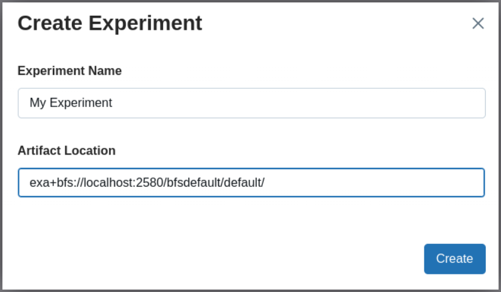

.. _starting the MLflow server:

Using the BucketFS Artifact Store
=================================

See the `MLflow documentation
<https://mlflow.org/docs/latest/self-hosting/architecture/artifact-store/#setting-a-default-artifact-location-for-logging>`_
for specifying the BucketFS Artifact Store either when starting the MLflow
server or when creating an MLflow *experiment*.

As Default Artifact Repository
------------------------------

The following command line starts an MLflow server with the BucketFS as the
default artifact store:

.. code-block:: shell

    EXA_BUCKETFS_PASSWORD="<your password>" \
    mlflow server --default-artifact-root \
    exa+bfs://localhost:2580/bfsdefault/default/

This option is only available if you have access to the MLflow server and can
change its startup options.

For more details, see :ref:`uri_format`.

For a Single MLflow Experiment
------------------------------

If you cannot change the startup options of your MLflow server, then you still
can use the BucketFS Artifact Store for individual MLflow *experiments*.

MLflow allows creating experiments via UI, CLI, and API.

.. _create_experiment_cli: https://mlflow.org/docs/latest/api_reference/cli.html#mlflow-experiments-create
.. _create_experiment_api: https://mlflow.org/docs/latest/ml/tracking/tracking-api/#experiment-organization

Create an MLflow Experiment via UI
^^^^^^^^^^^^^^^^^^^^^^^^^^^^^^^^^^

Create an MLflow Experiment via CLI
^^^^^^^^^^^^^^^^^^^^^^^^^^^^^^^^^^^

.. code-block:: shell

    mlflow experiments create \
      --experiment-name "My Experiment"
      --artifact-location "exa+bfs://localhost:2580/bfsdefault/default/my-experiment"

For details, see `MLflow CLI Documentation <create_experiment_cli_>`_ and
:ref:`URI Format<uri_format>`.

Create an MLflow Experiment via API
^^^^^^^^^^^^^^^^^^^^^^^^^^^^^^^^^^^

.. code-block:: python

    import mlflow

    uri = "exa+bfs://localhost:2580/bfsdefault/default/my-experiment"
    experiment_id = mlflow.create_experiment("My Experiment", artifact_location=uri)

For details, see `MLflow API Documentation <create_experiment_api_>`_ and
:ref:`URI Format<uri_format>`.
