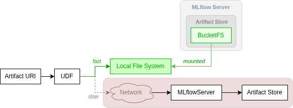

.. _exasol_docker_db: https://github.com/exasol/docker-db

Accessing Artifacts from Within a UDF
=====================================

Using the Exasol MLflow Plugin significantly speeds up loading MLflow models
in Exasol `UDFs
<https://docs.exasol.com/db/latest/database_concepts/udf_scripts.htm>`_.

There are a few things to keep in mind, though.

Alternatives for Loading an MLflow Model
----------------------------------------

The following figure shows different alternatives for loading an MLflow model
from within a UDF:

See the differences, prerequisites, benefits and drawbacks compared in the
following table:

.. list-table::
   :header-rows: 1

   * -
     - From the Local File System
     - Via MLflow REST API
   * - Speed
     - **Fastest option**
     - Significantly slower
   * - Supported Artifacts Stores
     - Only BucketFS
     - Arbitrary, incl. BucketFS
   * - Setting the MLflow Tracking URI
     - Not required
     - Required

When you cannot guarantee the model to be accessible in the local file system
of the UDF, some **utility functions** will help you to automatically choose
the fastest loading option, see the examples in the following sections for
details.

MLflow Tracking URI
-------------------

In all cases (potentially) accessing the MLflow server, the UDF needs to set
the MLflow Tracking URI. This can be done, by:

* Setting environment variable ``MLFLOW_TRACKING_URI`` or
* Calling ``mlflow.set_tracking_uri()`` within the UDF implementation.

Depending on the environment your Exasol instance is running in, the
MLflow Tracking URI might differ from the one you can use on your local
machine. This applies in particular when running an `Exasol DockerDB
<exasol_docker_db_>`_ instance inside a virtual machine.

Creating the UDF
----------------

After having built, deployed, and activated your SLC, you can use Exasol SQL
to define a UDF like this:

.. literalinclude:: ../../test/integration/with_mlflow_server/test_udfs.py
  :caption: Sample UDF loading an MLflow model using function
            ``local_path_or_uri()`` to read the model from the local file
            system if possible. The MLflow Tracking URI is passed via
            environment variable ``MLFLOW_TRACKING_URI``.
  :language: python
  :start-after: User Guide sample UDF #1
  :end-before: /end-sample
  :dedent: 8

Running the UDF
---------------

Now you can run the UDF via the following SQL statement

.. code-block:: sql

    SELECT "<SCHEMA>"."<UDF_NAME>"('exa+bfs://...');

Function ``local_path_or_uri()``
--------------------------------

The function checks if:

* The URI points to the BucketFS artifact store and
* The associated path is mounted into the local file system of the UDF.

If both conditions are true, then the function will return a path in the local
file system, that can be passed to one of the ``load_model()`` functions of
the MLflow API, e.g. ``mlflow.models.Model.load()`` or
``mlflow.sklearn.load_model()``.

Otherwise the function will return the original URI without changes, for
loading the model via the MLflow server which can be significantly slower.

Function ``load_model_with_fallback()``
---------------------------------------

Another option is using this function, which accepts the URI and the actual
load-function as arguments.

.. literalinclude:: ../../test/integration/with_mlflow_server/test_udfs.py
  :caption: Sample UDF loading an MLflow model via
            ``load_model_with_fallback()``. The MLflow Tracking URI is set via
            ``mlflow.set_tracking_uri()`` within the implementation of the
            UDF.
  :language: python
  :start-after: User Guide sample UDF #2
  :end-before: /end-sample
  :dedent: 8
